# ¡Hola! Soy Gabriel Iborra

Desarrollador Web en Formación en el CIFP Carlos III (DAW) | Técnico en Sistemas en el IES Dos Mares (SMR)

---

### En qué estoy trabajando ahora

*   Finalizando el Grado Superior de **Desarrollo de Aplicaciones Web (DAW)** en el CIFP Carlos III.
*   **ERP a Medida para el Sector de la Construcción y Reformas (Odoo 18)**:
    Un sistema integral diseñado para automatizar la carga administrativa y mitigar pérdidas económicas mediante un control financiero estricto en tiempo real.
    *   **Backend & DB:** Diseño de 14 modelos de negocio en Python sobre PostgreSQL (33 tablas en total contando submodelos de auditoría, adjuntos e incidencias), con restricciones de negocio (`@api.constrains`), campos calculados que se recalculan en tiempo real y cobertura de tests automatizados sobre la lógica financiera crítica. Modelos principales: Clientes, Trabajadores, Proveedores, Especialistas, Obras, Presupuestos (+ Líneas de Reforma), Gastos, Ingresos, Partes de Trabajo (+ Líneas), Partes de Especialista, Partes de Proveedor y Faltas de Trabajadores.
    *   **Frontend Analítico:** Dashboard interactivo desarrollado con el framework **OWL (Odoo Web Library)**, JS y CSS para renderizar KPIs de salud financiera y flujos de caja en vivo.

<b>Haz clic aquí para ver las capturas de la interfaz y reportes del ERP</b>

 

#### 1. Analytics & Dashboard Financiero

| KPIs & Rentabilidad | Distribución de Costes |
| :---: | :---: |
|  |  |
| *Análisis de salud financiera e indicadores clave de rendimiento* | *Desglose analítico de costes directos e indirectos* |

| Tesorería & Flujo de Caja | Evolución & Proyecciones |
| :---: | :---: |
|  |  |
| *Control de liquidez, entradas y salidas en tiempo real* | *Previsiones presupuestarias e históricos de balance* |

---

#### 2. Vistas de Gestión y Modelos de Datos

| Vista Kanban (Gestión de Obras / Proyectos) | Vista Formulario (Gestión de Partes de Trabajo) |
| :---: | :---: |
|  |  |
| *Flujo visual de estados y seguimiento analítico por etapa* | *Lógica relacional avanzada, validaciones y restricciones de negocio* |

**Esquema Relacional Completo (33 tablas)**

```mermaid
%%{init: {"themeVariables": {"fontSize": "14px"}} }%%
erDiagram

  GESTION_CLIENTES {
    varchar cliente_id PK
    varchar nombre
    varchar apellidos
    varchar nombre_completo
    varchar nif
    varchar direccion
    varchar cod_postal
    varchar telf
  }
  GESTION_CLIENTES_OBSERVACIONES {
    timestamp fecha_hora
    integer usuario_id FK
    text texto
    integer cliente_id FK
  }

  GESTION_TRABAJADORES {
    varchar trabajador_id PK
    varchar tipo
    varchar nombre
    varchar apellido
    varchar nombre_completo
    varchar telf
    float coste_hora_estandar
    float horas_totales
    float total_euros
  }
  GESTION_TRABAJADORES_OBSERVACIONES {
    timestamp fecha_hora
    integer usuario_id FK
    text texto
    integer trabajador_id FK
  }
  GESTION_TRABAJADORES_ARCHIVO {
    bytea archivo
    varchar nombre_archivo
    varchar tipo
    integer trabajadores_id FK
  }
  GESTION_TRABAJADORES_FALTA {
    integer trabajador_id FK
    date fecha_inicio
    date fecha_fin
    varchar tipo
    text motivo
    integer dias
    varchar trabajador_nombre_completo
  }

  GESTION_PROVEEDORES {
    varchar proveedor_id PK
    varchar nombre
    varchar direccion
    varchar telf
    varchar correo
    varchar tipo
    varchar ref
    varchar documento
    float base
    float iva
    float total
  }
  GESTION_PROVEEDORES_OBSERVACIONES {
    timestamp fecha_hora
    integer usuario_id FK
    text texto
    integer proveedor_id FK
  }
  GESTION_PROVEEDORES_ARCHIVO {
    bytea archivo
    varchar nombre_archivo
    varchar tipo
    integer proveedores_id FK
  }

  GESTION_ESPECIALISTAS {
    varchar especialista_id PK
    varchar tipo
    varchar ref
    varchar nombre
    varchar telf
    varchar correo
    float importe
  }
  GESTION_ESPECIALISTAS_OBSERVACIONES {
    timestamp fecha_hora
    integer usuario_id FK
    text texto
    integer especialista_id FK
  }
  GESTION_ESPECIALISTAS_ARCHIVO {
    bytea archivo
    varchar nombre_archivo
    varchar tipo
    integer especialistas_id FK
  }

  GESTION_OBRAS {
    varchar obra_id PK
    text descripcion
    float total
    float horas_totales_obra
    float coste_moo_obra
    varchar estado_pago
    varchar salud_obra
    integer cliente_id FK
  }
  GESTION_OBRAS_OBSERVACIONES {
    timestamp fecha_hora
    integer usuario_id FK
    text texto
    integer obra_id FK
  }
  GESTION_OBRAS_INCIDENCIAS {
    timestamp fecha_hora
    integer usuario_id FK
    text texto
    integer obra_id FK
  }
  GESTION_OBRAS_ARCHIVO {
    bytea archivo
    varchar nombre_archivo
    varchar tipo
    integer obra_id FK
  }

  GESTION_PRESUPUESTOS {
    varchar presupuesto_id PK
    date fecha
    integer anio
    varchar nombre_cliente
    varchar nif
    varchar direccion
    varchar telf
    numeric base_imponible
    float iva
    numeric cuota_iva
    numeric total
    varchar estado
    integer cliente_id FK
    integer obra_id FK
  }
  GESTION_PRESUPUESTO_LINEA {
    numeric precio
    integer uds
    text descripcion
    numeric total_linea
    integer presupuesto_id FK
  }
  GESTION_PRESUPUESTOS_OBSERVACIONES {
    timestamp fecha_hora
    integer usuario_id FK
    text texto
    integer presupuesto_id FK
  }
  GESTION_PRESUPUESTOS_INCIDENCIAS {
    timestamp fecha_hora
    integer usuario_id FK
    text texto
    integer presupuesto_id FK
  }
  GESTION_PRESUPUESTOS_ARCHIVO {
    bytea archivo
    varchar nombre_archivo
    varchar tipo
    integer presupuestos_id FK
  }

  GESTION_GASTOS {
    varchar gasto_id PK
    varchar estado
    date inicio_obra
    date fin_obra
    varchar mandante
    varchar gestion_licencia
    varchar pago_icio
    float ingresos
    float gastos
    float beneficio_real
    float coste_proveedores
    float coste_especialistas
    float coste_moo
    integer obra_id FK
    integer presupuesto_id FK
    integer cliente_id FK
  }
  GESTION_GASTOS_ARCHIVO {
    bytea archivo
    varchar nombre_archivo
    varchar tipo
    integer gasto_id FK
  }

  GESTION_INGRESOS {
    varchar ingreso_id PK
    varchar nombre_obra
    varchar tipo
    date fecha
    integer anio
    varchar documento
    float importe
    float total_ingresos
    float debe
    integer obra_id FK
    integer cliente_id FK
  }
  GESTION_INGRESOS_OBSERVACIONES {
    timestamp fecha_hora
    integer usuario_id FK
    text texto
    integer ingreso_id FK
  }
  GESTION_INGRESOS_ARCHIVO {
    bytea archivo
    varchar nombre_archivo
    varchar tipo
    integer ingresos_id FK
  }

  GESTION_PARTES_TRABAJO {
    date fecha
    text descripcion
    float horas_totales
    float coste_total_parte
    integer obra_id FK
  }
  GESTION_PARTES_TRABAJO_LINEA {
    float horas
    float coste_hora
    float coste_subtotal
    integer parte_id FK
    integer trabajador_id FK
  }

  GESTION_PARTES_ESPECIALISTA {
    integer obra_id FK
    integer especialista_id FK
    varchar especialista_nombre
    date fecha
    text descripcion
    varchar documento
    float importe
    varchar estado_pago
  }
  GESTION_PARTES_ESPECIALISTA_ARCHIVO {
    bytea archivo
    varchar nombre_archivo
    varchar tipo
    integer parte_id FK
  }

  GESTION_PARTES_PROVEEDOR {
    integer obra_id FK
    integer proveedor_id FK
    varchar proveedor_nombre
    date fecha
    text descripcion
    varchar documento
    float importe
    varchar estado_pago
  }
  GESTION_PARTES_PROVEEDOR_ARCHIVO {
    bytea archivo
    varchar nombre_archivo
    varchar tipo
    integer parte_id FK
  }

  %% ── Relaciones 1:N (Many2one en la tabla hija, One2many como vista inversa) ──
  GESTION_CLIENTES ||--o{ GESTION_CLIENTES_OBSERVACIONES : cliente_id
  GESTION_CLIENTES ||--o{ GESTION_OBRAS : cliente_id
  GESTION_CLIENTES ||--o{ GESTION_PRESUPUESTOS : cliente_id
  GESTION_CLIENTES ||--o{ GESTION_INGRESOS : cliente_id
  GESTION_CLIENTES ||--o{ GESTION_GASTOS : "cliente_id (related)"

  GESTION_TRABAJADORES ||--o{ GESTION_TRABAJADORES_OBSERVACIONES : trabajador_id
  GESTION_TRABAJADORES ||--o{ GESTION_TRABAJADORES_ARCHIVO : trabajadores_id
  GESTION_TRABAJADORES ||--o{ GESTION_TRABAJADORES_FALTA : trabajador_id
  GESTION_TRABAJADORES ||--o{ GESTION_PARTES_TRABAJO_LINEA : trabajador_id

  GESTION_PROVEEDORES ||--o{ GESTION_PROVEEDORES_OBSERVACIONES : proveedor_id
  GESTION_PROVEEDORES ||--o{ GESTION_PROVEEDORES_ARCHIVO : proveedores_id
  GESTION_PROVEEDORES ||--o{ GESTION_PARTES_PROVEEDOR : proveedor_id

  GESTION_ESPECIALISTAS ||--o{ GESTION_ESPECIALISTAS_OBSERVACIONES : especialista_id
  GESTION_ESPECIALISTAS ||--o{ GESTION_ESPECIALISTAS_ARCHIVO : especialistas_id
  GESTION_ESPECIALISTAS ||--o{ GESTION_PARTES_ESPECIALISTA : especialista_id

  GESTION_OBRAS ||--o{ GESTION_OBRAS_OBSERVACIONES : obra_id
  GESTION_OBRAS ||--o{ GESTION_OBRAS_INCIDENCIAS : obra_id
  GESTION_OBRAS ||--o{ GESTION_OBRAS_ARCHIVO : obra_id
  GESTION_OBRAS ||--o{ GESTION_PRESUPUESTOS : obra_id
  GESTION_OBRAS ||--o{ GESTION_INGRESOS : obra_id
  GESTION_OBRAS ||--o{ GESTION_PARTES_TRABAJO : obra_id
  GESTION_OBRAS ||--o{ GESTION_PARTES_ESPECIALISTA : obra_id
  GESTION_OBRAS ||--o{ GESTION_PARTES_PROVEEDOR : obra_id
  GESTION_OBRAS ||--|| GESTION_GASTOS : "obra_id (1:1 unique)"

  GESTION_PRESUPUESTOS ||--o{ GESTION_PRESUPUESTO_LINEA : presupuesto_id
  GESTION_PRESUPUESTOS ||--o{ GESTION_PRESUPUESTOS_OBSERVACIONES : presupuesto_id
  GESTION_PRESUPUESTOS ||--o{ GESTION_PRESUPUESTOS_INCIDENCIAS : presupuesto_id
  GESTION_PRESUPUESTOS ||--o{ GESTION_PRESUPUESTOS_ARCHIVO : presupuestos_id
  GESTION_PRESUPUESTOS ||--o{ GESTION_GASTOS : "presupuesto_id (opcional)"

  GESTION_GASTOS ||--o{ GESTION_GASTOS_ARCHIVO : gasto_id

  GESTION_INGRESOS ||--o{ GESTION_INGRESOS_OBSERVACIONES : ingreso_id
  GESTION_INGRESOS ||--o{ GESTION_INGRESOS_ARCHIVO : ingresos_id

  GESTION_PARTES_TRABAJO ||--o{ GESTION_PARTES_TRABAJO_LINEA : parte_id
  GESTION_PARTES_ESPECIALISTA ||--o{ GESTION_PARTES_ESPECIALISTA_ARCHIVO : parte_id
  GESTION_PARTES_PROVEEDOR ||--o{ GESTION_PARTES_PROVEEDOR_ARCHIVO : parte_id

  %% ── Relaciones N:M (tabla puente) ──
  GESTION_TRABAJADORES }o--o{ GESTION_OBRAS : obra_ids
  GESTION_PROVEEDORES }o--o{ GESTION_PRESUPUESTOS : "presupuesto_ids (tabla proveedor_id)"
  GESTION_PROVEEDORES }o--o{ GESTION_OBRAS : obra_ids
  GESTION_ESPECIALISTAS }o--o{ GESTION_PRESUPUESTOS : "presupuesto_ids (tabla especialista_id)"
  GESTION_ESPECIALISTAS }o--o{ GESTION_OBRAS : obra_ids
  GESTION_PRESUPUESTOS }o--o{ GESTION_PROVEEDORES : "proveedor_ids (independiente)"
  GESTION_PRESUPUESTOS }o--o{ GESTION_ESPECIALISTAS : "especialista_ids (independiente)"
  GESTION_OBRAS }o--o{ GESTION_TRABAJADORES : "trabajador_ids (calculado)"
  GESTION_OBRAS }o--o{ GESTION_PROVEEDORES : "proveedor_ids (calculado)"
  GESTION_OBRAS }o--o{ GESTION_ESPECIALISTAS : "especialista_ids (calculado)"
```

*Diagrama entidad-relación completo generado a partir de los modelos Odoo — clic para ampliar.*

---

#### 3. Documentos y Reportes Impresos (PDF/QWeb)

| Presupuesto de Obra | Informe de Estado de Obra | Parte de Trabajo Diario |
| :---: | :---: | :---: |
|  |  |  |
| *Presupuesto detallado para cliente con impuestos e imprevistos* | *Resumen ejecutivo de costes, avance y desviaciones* | *Control diario de mano de obra y materiales consumidos* |

---

### Portfolio y Proyectos Destacados

*   **ERP Construcción - Dashboard Financiero (React & TypeScript)**
    Ecosistema frontend modular e inteligente para el análisis contable y control presupuestario de obras en tiempo real.
    *   **Características:** Arquitectura basada en componentes atómicos, filtrado predictivo relacional optimizado con `useMemo` (inmune a discrepancias de texto), y automatización interactiva de importes netos/IVA mediante React Hook Form y Zod.
    *   **Visualización:** Gráficos de balance e históricos con Recharts y sistema global de notificaciones reactivas a través de un contexto personalizado manejado por el hook `useToast`.
    *   **Despliegue Activo:** Ver despliegue [despliegue en Vercel](https://dashboard-financiero-kappa-blue.vercel.app/) | Ver repositorio [Ver repositorio de código](https://github.com/pdawgabriel-hub/dashboard-financiero.git)

*   **GeoAlquiler - Inteligencia Inmobiliaria y Análisis Espacial (R & Shiny)**
    Aplicación web analítica construida como paquete de R (framework `{golem}`) que transforma datos de anuncios de alquiler en inteligencia de mercado accionable, combinando geolocalización, Machine Learning y herramientas de decisión de inversión inmobiliaria. *Por ahora, los datos son ficticios (generados de forma simulada) y el despliegue está en desarrollo.*
    *   **Características:** Arquitectura modular en 14 módulos Shiny independientes siguiendo el patrón de Shiny Modules (`NS(id)` + `*UI()`/`*Server()`), filtros globales reactivos compartidos entre todos los módulos, y gestión de dependencias reproducible con `{renv}`.
    *   **Analítica & ML:** Modelo predictivo de precios por regresión, recomendador de inmuebles similares con K-Nearest Neighbors (KNN), detector automático de oportunidades de inversión y calculadora de rentabilidad con proyección de cash flow.
    *   **Visualización:** Mapa interactivo con capa de calor (`leaflet`/`leaflet.extras`), tablas interactivas (`DT`) y gráficos dinámicos con `plotly`.
    *   **Despliegue Activo:** [Ver despliegue en shinyapps.io](https://pdawgabriel-hub.shinyapps.io/geoalquiler/) | [Ver repositorio de código](https://github.com/pdawgabriel-hub/geo-alquiler)

---

### Próximamente

*   **LuzPredict - Predicción del Precio de la Luz (PVPC) con Python** *(idea en fase de planificación, aún sin repositorio)*
    Proyecto pensado para predecir el precio horario de la electricidad en España a partir de datos públicos reales de la API de ESIOS/REE, con un recomendador de las horas más económicas del día siguiente para el consumo doméstico.
    *   **Enfoque técnico previsto:** Ingesta desde una API pública real (no dataset estático), *feature engineering* temporal (lags, festivos, estacionalidad), modelos de forecasting (LightGBM / Prophet) con validación temporal correcta, y despliegue en Streamlit Community Cloud.

---

### Tecnologías y Herramientas

**Ecosistema ERP y Frameworks**

**Backend y Lógica**

**Frontend y Estilos**

**Ciencia de Datos & Analítica (R)**

**Bases de Datos y Sistemas**

---

### Contacto

*   **Email:** [pdawgabriel@gmail.com](mailto:pdawgabriel@gmail.com)
