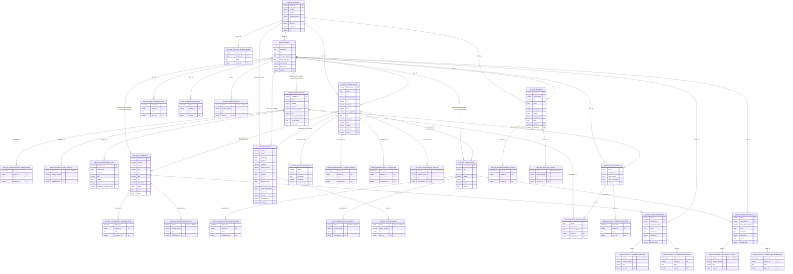

# ¡Hola! Soy Gabriel Iborra

Desarrollador Web en Formación en el CIFP Carlos III (GSDAW) | Técnico en Sistemas en el IES Dos Mares (GMSMR)

---

### En qué estoy trabajando ahora

*   Finalizando el Grado Superior de **Desarrollo de Aplicaciones Web (DAW)** en el CIFP Carlos III.
*   **Rock & Roll Pizza — Web para un cliente real (Astro & Sanity)**:
    Proyecto real para una pizzería, con la que sustituyo un WordPress inicial por una web más ligera. Aún en fase de diseño y maquetación.
    *   **Funciones:** portada, oferta de la semana editable por el cliente (con fecha de inicio y fin), carta (imágenes y PDF descargable), sección "Quiénes somos" y contacto con dirección, teléfono y horario.
    *   **Gestión de contenido:** el cliente cambia la oferta y los datos del negocio desde un panel propio (Sanity Studio), con correo y contraseña, sin tocar código; la web se reconstruye sola al publicar.
    *   **Estado:** en desarrollo, trabajando el diseño y el contenido antes de conectar el panel y pasar a producción. El repositorio es privado por tratarse de un proyecto de cliente.
    *   **Demo (previa a producción):** [Ver demo en Vercel](https://rock-and-roll-pizza.vercel.app/)

<details>
<summary><b>Haz clic aquí para ver la estructura del proyecto</b></summary>

<br>

```
rock-and-roll-pizza/
├── web/                  # Astro + Tailwind
│   ├── src/
│   │   ├── assets/       # logo, imágenes
│   │   ├── components/   # Header, Hero, Oferta, Carta, Nosotros, Contacto, Footer
│   │   ├── data/         # datos de ejemplo (site, oferta)
│   │   ├── layouts/
│   │   └── pages/
│   └── public/
└── studio/               # Sanity Studio (panel del cliente)
```

</details>

*   **ERP a Medida para el Sector de la Construcción y Reformas (Odoo 18)**:
    Un sistema integral diseñado para automatizar la carga administrativa y mitigar pérdidas económicas mediante un control financiero estricto en tiempo real. Cubre todo el ciclo de una obra — cliente → presupuesto (con IVA y líneas de reforma) → obra → ejecución (partes de trabajo, especialistas y proveedores) → cierre financiero (ingresos, gastos, beneficio real y saldo pendiente) — con roles de usuario diferenciados y un panel de Análisis Financiero agregado de toda la cartera de obras. Desarrollado para una empresa real de construcción y reformas; preparado para su despliegue en el servidor del cliente.
    *   **Backend & DB:** Diseño de 14 modelos de negocio en Python sobre PostgreSQL (41 tablas: 35 de datos, incluidos los historiales de observaciones e incidencias y los adjuntos, y 6 tablas puente), con restricciones de negocio (`@api.constrains`), campos calculados que se recalculan en tiempo real y 19 tests automatizados sobre la lógica financiera y la integridad de los datos. Modelos principales: Clientes, Trabajadores, Proveedores, Especialistas, Obras, Presupuestos (+ Líneas de Reforma), Gastos, Ingresos, Partes de Trabajo (+ Líneas), Partes de Especialista, Partes de Proveedor y Faltas de Trabajadores.
    *   **Integridad de datos:** Presupuestos e ingresos siempre del cliente de su obra, todo cobro ligado a una obra, obras con cobros protegidas contra el borrado, borrados en cascada a través del ORM (recalculando los acumulados y eliminando también los ficheros adjuntos), ficha financiera 1:1 que nace y desaparece con su obra, y migraciones de datos versionadas para cambios con la base de datos ya en producción.
    *   **Frontend Analítico:** Dashboard interactivo desarrollado con el framework **OWL (Odoo Web Library)**, JS y CSS para renderizar KPIs de salud financiera y flujos de caja en vivo. Interfaz adaptada también a móvil.
    *   **Infraestructura y Despliegue:** Docker Compose con Odoo, PostgreSQL y Nginx Proxy Manager (HTTPS con Let's Encrypt), volúmenes persistentes con nombre, puertos internos accesibles solo en local, copias de seguridad automáticas de la base de datos y de los adjuntos con restauración verificada, plantillas de configuración y flujo de ramas `develop`/`main`. Los datos de demostración solo se generan en bases de datos de desarrollo, para no trabajar nunca con datos reales de clientes fuera de producción.
    *   **Documentación:** Informe técnico completo (arquitectura, cada modelo con sus campos, relaciones y métodos, y las reglas de negocio independientes del framework con una guía para reimplementarlo en otro stack: modelo relacional, equivalencias de conceptos de Odoo y escenario de pruebas), esquema SQL contrastado con la base de datos real y diagramas entidad-relación, guía de usuario de 37 páginas (cada pantalla, campo, filtro y agrupación explicados sin tecnicismos) y guía de despliegue paso a paso con lista de comprobación para producción — base para la futura migración de este mismo proyecto a otro stack (ver "Próximamente").

<details>
<summary><b>Haz clic aquí para ver las capturas de la interfaz y reportes del ERP</b></summary>

<br>

#### 1. Analytics & Dashboard Financiero

| KPIs & Rentabilidad | Distribución de Costes |
| :---: | :---: |
|  |  |
| *Análisis de salud financiera e indicadores clave de rendimiento* | *Desglose analítico de costes directos e indirectos* |

| Tesorería & Flujo de Caja | Evolución & Proyecciones |
| :---: | :---: |
|  |  |
| *Control de liquidez, entradas y salidas en tiempo real* | *Previsiones presupuestarias e históricos de balance* |

---

#### 2. Vistas de Gestión y Modelos de Datos

| Vista Kanban (Gestión de Obras / Proyectos) | Vista Formulario (Gestión de Partes de Trabajo) |
| :---: | :---: |
|  |  |
| *Flujo visual de estados y seguimiento analítico por etapa* | *Lógica relacional avanzada, validaciones y restricciones de negocio* |

**Esquema Relacional Completo (41 tablas)**


```mermaid
%%{init: {"themeVariables": {"fontSize": "14px"}} }%%
erDiagram

  GESTION_CLIENTES {
    varchar cliente_id PK
    varchar nombre
    varchar apellidos
    varchar nombre_completo
    varchar nif
    varchar direccion
    varchar cod_postal
    varchar telf
  }
  GESTION_CLIENTES_OBSERVACIONES {
    timestamp fecha_hora
    integer usuario_id FK
    text texto
    integer cliente_id FK
  }

  GESTION_TRABAJADORES {
    varchar trabajador_id PK
    varchar tipo
    varchar nombre
    varchar apellido
    varchar nombre_completo
    varchar telf
    float coste_hora_estandar
    float horas_totales
    float total_euros
  }
  GESTION_TRABAJADORES_OBSERVACIONES {
    timestamp fecha_hora
    integer usuario_id FK
    text texto
    integer trabajador_id FK
  }
  GESTION_TRABAJADORES_ARCHIVO {
    binary archivo "fichero en filestore"
    varchar nombre_archivo
    varchar tipo
    integer trabajadores_id FK
  }
  GESTION_TRABAJADORES_FALTA {
    integer trabajador_id FK
    date fecha_inicio
    date fecha_fin
    varchar tipo
    text motivo
    integer dias
    varchar trabajador_nombre_completo
  }

  GESTION_PROVEEDORES {
    varchar proveedor_id PK
    varchar nombre
    varchar direccion
    varchar telf
    varchar correo
    varchar tipo
    varchar ref
    varchar documento
    float base
    float iva
    float total
  }
  GESTION_PROVEEDORES_OBSERVACIONES {
    timestamp fecha_hora
    integer usuario_id FK
    text texto
    integer proveedor_id FK
  }
  GESTION_PROVEEDORES_ARCHIVO {
    binary archivo "fichero en filestore"
    varchar nombre_archivo
    varchar tipo
    integer proveedores_id FK
  }

  GESTION_ESPECIALISTAS {
    varchar especialista_id PK
    varchar tipo
    varchar ref
    varchar nombre
    varchar telf
    varchar correo
    float importe
  }
  GESTION_ESPECIALISTAS_OBSERVACIONES {
    timestamp fecha_hora
    integer usuario_id FK
    text texto
    integer especialista_id FK
  }
  GESTION_ESPECIALISTAS_ARCHIVO {
    binary archivo "fichero en filestore"
    varchar nombre_archivo
    varchar tipo
    integer especialistas_id FK
  }

  GESTION_OBRAS {
    varchar obra_id PK
    text descripcion
    float total
    float horas_totales_obra
    float coste_moo_obra
    varchar estado_pago
    varchar salud_obra
    integer cliente_id FK
  }
  GESTION_OBRAS_OBSERVACIONES {
    timestamp fecha_hora
    integer usuario_id FK
    text texto
    integer obra_id FK
  }
  GESTION_OBRAS_INCIDENCIAS {
    timestamp fecha_hora
    integer usuario_id FK
    text texto
    integer obra_id FK
  }
  GESTION_OBRAS_ARCHIVO {
    binary archivo "fichero en filestore"
    varchar nombre_archivo
    varchar tipo
    integer obra_id FK
  }

  GESTION_PRESUPUESTOS {
    varchar presupuesto_id PK
    date fecha
    integer anio
    varchar nombre_cliente
    varchar nif
    varchar direccion
    varchar telf
    numeric base_imponible
    float iva
    numeric cuota_iva
    numeric total
    varchar estado
    integer cliente_id FK
    integer obra_id FK
  }
  GESTION_PRESUPUESTO_LINEA {
    numeric precio
    integer uds
    text descripcion
    numeric total_linea
    integer presupuesto_id FK
  }
  GESTION_PRESUPUESTOS_OBSERVACIONES {
    timestamp fecha_hora
    integer usuario_id FK
    text texto
    integer presupuesto_id FK
  }
  GESTION_PRESUPUESTOS_INCIDENCIAS {
    timestamp fecha_hora
    integer usuario_id FK
    text texto
    integer presupuesto_id FK
  }
  GESTION_PRESUPUESTOS_ARCHIVO {
    binary archivo "fichero en filestore"
    varchar nombre_archivo
    varchar tipo
    integer presupuestos_id FK
  }

  GESTION_GASTOS {
    varchar gasto_id PK
    varchar estado
    date inicio_obra
    date fin_obra
    varchar mandante
    varchar gestion_licencia
    varchar pago_icio
    float ingresos
    float gastos
    float beneficio_real
    float coste_proveedores
    float coste_especialistas
    float coste_moo
    integer obra_id FK
    integer presupuesto_id FK
    integer cliente_id FK
  }
  GESTION_GASTOS_ARCHIVO {
    binary archivo "fichero en filestore"
    varchar nombre_archivo
    varchar tipo
    integer gasto_id FK
  }

  GESTION_INGRESOS {
    varchar ingreso_id PK
    varchar nombre_obra
    varchar tipo
    date fecha
    integer anio
    varchar documento
    float importe
    float total_ingresos
    float debe
    integer obra_id FK
    integer cliente_id FK
  }
  GESTION_INGRESOS_OBSERVACIONES {
    timestamp fecha_hora
    integer usuario_id FK
    text texto
    integer ingreso_id FK
  }
  GESTION_INGRESOS_ARCHIVO {
    binary archivo "fichero en filestore"
    varchar nombre_archivo
    varchar tipo
    integer ingresos_id FK
  }

  GESTION_PARTES_TRABAJO {
    date fecha
    text descripcion
    float horas_totales
    float coste_total_parte
    integer obra_id FK
  }
  GESTION_PARTES_TRABAJO_LINEA {
    float horas
    float coste_hora
    float coste_subtotal
    integer parte_id FK
    integer trabajador_id FK
  }
  GESTION_PARTES_TRABAJO_INCIDENCIAS {
    timestamp fecha_hora
    integer usuario_id FK
    text texto
    integer parte_id FK
  }

  GESTION_PARTES_ESPECIALISTA {
    integer obra_id FK
    integer especialista_id FK
    varchar especialista_nombre
    date fecha
    text descripcion
    varchar documento
    float importe
    varchar estado_pago
  }
  GESTION_PARTES_ESPECIALISTA_ARCHIVO {
    binary archivo "fichero en filestore"
    varchar nombre_archivo
    varchar tipo
    integer parte_id FK
  }
  GESTION_PARTES_ESPECIALISTA_INCIDENCIAS {
    timestamp fecha_hora
    integer usuario_id FK
    text texto
    integer parte_id FK
  }

  GESTION_PARTES_PROVEEDOR {
    integer obra_id FK
    integer proveedor_id FK
    varchar proveedor_nombre
    date fecha
    text descripcion
    varchar documento
    float importe
    varchar estado_pago
  }
  GESTION_PARTES_PROVEEDOR_ARCHIVO {
    binary archivo "fichero en filestore"
    varchar nombre_archivo
    varchar tipo
    integer parte_id FK
  }
  GESTION_PARTES_PROVEEDOR_INCIDENCIAS {
    timestamp fecha_hora
    integer usuario_id FK
    text texto
    integer parte_id FK
  }

  %% ── Relaciones 1:N (Many2one en la tabla hija, One2many como vista inversa) ──
  GESTION_CLIENTES ||--o{ GESTION_CLIENTES_OBSERVACIONES : cliente_id
  GESTION_CLIENTES ||--o{ GESTION_OBRAS : cliente_id
  GESTION_CLIENTES ||--o{ GESTION_PRESUPUESTOS : cliente_id
  GESTION_CLIENTES ||--o{ GESTION_INGRESOS : cliente_id
  GESTION_CLIENTES ||--o{ GESTION_GASTOS : "cliente_id (related)"

  GESTION_TRABAJADORES ||--o{ GESTION_TRABAJADORES_OBSERVACIONES : trabajador_id
  GESTION_TRABAJADORES ||--o{ GESTION_TRABAJADORES_ARCHIVO : trabajadores_id
  GESTION_TRABAJADORES ||--o{ GESTION_TRABAJADORES_FALTA : trabajador_id
  GESTION_TRABAJADORES ||--o{ GESTION_PARTES_TRABAJO_LINEA : trabajador_id

  GESTION_PROVEEDORES ||--o{ GESTION_PROVEEDORES_OBSERVACIONES : proveedor_id
  GESTION_PROVEEDORES ||--o{ GESTION_PROVEEDORES_ARCHIVO : proveedores_id
  GESTION_PROVEEDORES ||--o{ GESTION_PARTES_PROVEEDOR : proveedor_id

  GESTION_ESPECIALISTAS ||--o{ GESTION_ESPECIALISTAS_OBSERVACIONES : especialista_id
  GESTION_ESPECIALISTAS ||--o{ GESTION_ESPECIALISTAS_ARCHIVO : especialistas_id
  GESTION_ESPECIALISTAS ||--o{ GESTION_PARTES_ESPECIALISTA : especialista_id

  GESTION_OBRAS ||--o{ GESTION_OBRAS_OBSERVACIONES : obra_id
  GESTION_OBRAS ||--o{ GESTION_OBRAS_INCIDENCIAS : obra_id
  GESTION_OBRAS ||--o{ GESTION_OBRAS_ARCHIVO : obra_id
  GESTION_OBRAS ||--o{ GESTION_PRESUPUESTOS : obra_id
  GESTION_OBRAS ||--o{ GESTION_INGRESOS : obra_id
  GESTION_OBRAS ||--o{ GESTION_PARTES_TRABAJO : obra_id
  GESTION_OBRAS ||--o{ GESTION_PARTES_ESPECIALISTA : obra_id
  GESTION_OBRAS ||--o{ GESTION_PARTES_PROVEEDOR : obra_id
  GESTION_OBRAS ||--|| GESTION_GASTOS : "obra_id (1:1 unique)"

  GESTION_PRESUPUESTOS ||--o{ GESTION_PRESUPUESTO_LINEA : presupuesto_id
  GESTION_PRESUPUESTOS ||--o{ GESTION_PRESUPUESTOS_OBSERVACIONES : presupuesto_id
  GESTION_PRESUPUESTOS ||--o{ GESTION_PRESUPUESTOS_INCIDENCIAS : presupuesto_id
  GESTION_PRESUPUESTOS ||--o{ GESTION_PRESUPUESTOS_ARCHIVO : presupuestos_id
  GESTION_PRESUPUESTOS ||--o{ GESTION_GASTOS : "presupuesto_id (opcional)"

  GESTION_GASTOS ||--o{ GESTION_GASTOS_ARCHIVO : gasto_id

  GESTION_INGRESOS ||--o{ GESTION_INGRESOS_OBSERVACIONES : ingreso_id
  GESTION_INGRESOS ||--o{ GESTION_INGRESOS_ARCHIVO : ingresos_id

  GESTION_PARTES_TRABAJO ||--o{ GESTION_PARTES_TRABAJO_LINEA : parte_id
  GESTION_PARTES_TRABAJO ||--o{ GESTION_PARTES_TRABAJO_INCIDENCIAS : parte_id
  GESTION_PARTES_ESPECIALISTA ||--o{ GESTION_PARTES_ESPECIALISTA_ARCHIVO : parte_id
  GESTION_PARTES_ESPECIALISTA ||--o{ GESTION_PARTES_ESPECIALISTA_INCIDENCIAS : parte_id
  GESTION_PARTES_PROVEEDOR ||--o{ GESTION_PARTES_PROVEEDOR_ARCHIVO : parte_id
  GESTION_PARTES_PROVEEDOR ||--o{ GESTION_PARTES_PROVEEDOR_INCIDENCIAS : parte_id

  %% ── Relaciones N:M (tabla puente) ──
  %% Obras <-> Trabajadores/Proveedores/Especialistas: UNA sola tabla puente por
  %% pareja, compartida por el campo calculado de la obra y el obra_ids del recurso.
  GESTION_OBRAS }o--o{ GESTION_TRABAJADORES : "trabajador_ids calculado = obra_ids (solo lectura)"
  GESTION_OBRAS }o--o{ GESTION_PROVEEDORES : "proveedor_ids calculado = obra_ids (solo lectura)"
  GESTION_OBRAS }o--o{ GESTION_ESPECIALISTAS : "especialista_ids calculado = obra_ids (solo lectura)"
  GESTION_TRABAJADORES }o--o{ GESTION_PARTES_TRABAJO : "parte_trabajo_ids (calculado)"
  %% Presupuestos <-> Proveedores/Especialistas: una tabla puente por pareja, vista desde los dos lados.
  GESTION_PRESUPUESTOS }o--o{ GESTION_PROVEEDORES : "proveedor_ids = presupuesto_ids"
  GESTION_PRESUPUESTOS }o--o{ GESTION_ESPECIALISTAS : "especialista_ids = presupuesto_ids"
```

*Diagrama entidad-relación completo generado a partir de los modelos Odoo — clic para ampliar.*

---

#### 3. Documentos y Reportes Impresos (PDF/QWeb)

| Presupuesto de Obra | Informe de Estado de Obra | Parte de Trabajo Diario |
| :---: | :---: | :---: |
|  |  |  |
| *Presupuesto detallado para cliente con impuestos e imprevistos* | *Resumen ejecutivo de costes, avance y desviaciones* | *Control diario de mano de obra y materiales consumidos* |

</details>

---

### Portfolio y Proyectos Destacados

*   **ERP Construcción - Dashboard Financiero (React & TypeScript)**
    Ecosistema frontend modular e inteligente para el análisis contable y control presupuestario de obras en tiempo real, adaptando a una versión 100% frontend (sin backend ni base de datos física, persistencia en `localStorage` versionado) el modelo de negocio de 13 entidades del ERP a medida hecho sobre Odoo.
    *   **Características:** Vistas intercambiables de tarjetas/lista con tarjetas totalmente clicables, registros relacionados tipo "smart button" en cada ficha (Cliente, Obra, Trabajador...), calendario mensual tipo Google Calendar, autocompletado con combobox buscable en los selectores de relación, y filtrado predictivo relacional optimizado con `useMemo` (inmune a discrepancias de texto).
    *   **Formularios y Documentos:** Automatización interactiva de importes netos/IVA mediante React Hook Form y Zod, y exportación a PDF (Presupuestos, Partes de Trabajo, seguimiento de Gastos) vía páginas de impresión dedicadas y `window.print()`.
    *   **Visualización:** Gráficos de balance e históricos con Recharts y sistema global de notificaciones reactivas a través de un contexto personalizado manejado por el hook `useToast`.
    *   **Despliegue Activo:** Ver despliegue [despliegue en Vercel](https://dashboard-financiero-kappa-blue.vercel.app/) | Ver repositorio [Ver repositorio de código](https://github.com/pdawgabriel-hub/dashboard-financiero.git)

*   **GeoAlquiler - Inteligencia Inmobiliaria y Observatorio del Alquiler en España (R & Shiny)**
    Aplicación web analítica construida como paquete de R (framework `{golem}`) con dos partes: análisis de un mercado de anuncios de alquiler en cinco ciudades, con Machine Learning y herramientas de inversión, y un **Observatorio del Alquiler** a escala nacional que cruza datos oficiales de los ~8.200 municipios de España. Todos los datos proceden de fuentes reales a través de un pipeline de ingesta propio.
    *   **Observatorio del Alquiler en España:** mapa coroplético municipal que cruza el índice oficial de alquiler del Ministerio de Vivienda (SERPAVI) con la renta media de los hogares y el padrón del INE y el parque residencial del Catastro, todo del mismo año. 8 indicadores (alquiler €/m², esfuerzo del alquiler sobre la renta, peso del alquiler en el parque de viviendas, valor catastral, población…), ficha de cada municipio con su percentil nacional, gráfico renta vs. alquiler y ranking, sincronizados entre sí.
    *   **Datos e ingesta:** precios por zona de fuentes autonómicas (Generalitat de Catalunya, Generalitat Valenciana y Gobierno Vasco), con anclas documentadas a mano donde no existe fuente oficial. Para el Observatorio: la capa municipal de SERPAVI, la tabla nacional de renta del INE (~350 MB) filtrada en streaming y las estadísticas del Catastro por provincia, extraídas reproduciendo su formulario web. El Catastro no publica el código INE, así que los municipios se cruzan por nombre (normalizado, aproximado y con equivalencias para municipios renombrados) hasta cubrir todos sus registros.
    *   **Analítica & ML:** modelo predictivo de precios por regresión, recomendador de inmuebles similares con K-Nearest Neighbors (KNN), detector automático de oportunidades de inversión, calculadora de rentabilidad con amortización hipotecaria y proyección de cash flow, e informe ejecutivo descargable.
    *   **Arquitectura:** 15 módulos Shiny independientes (`NS(id)` + `*UI()`/`*Server()`) con la lógica de negocio separada en funciones puras sin dependencias de Shiny, que comparten el pipeline y la app. Documentada con esquema de arquitectura y una [guía técnica](https://github.com/pdawgabriel-hub/geo-alquiler/blob/main/docs/GUIA_TECNICA.md) con recorrido por el código.
    *   **Rendimiento:** mapas agregados en servidor, `plotly` nativo con histogramas pre-agregados y submuestreo en gráficos densos. El Observatorio pinta ~8.200 polígonos con geometría en dos niveles de detalle, un serializador JSON vectorizado propio (de ~6 s a ~1,4 s) y recoloreo en el navegador con JavaScript al cambiar de indicador: el mapa nacional aparece en ~1,2 s, frente a los ~3,2 s iniciales.
    *   **Calidad:** 29 tests con 102 comprobaciones (`testthat` y `testServer()` para los módulos) sobre los cálculos financieros, los indicadores y el cruce de fuentes; integración continua con GitHub Actions que instala desde cero las versiones exactas de `{renv}` y ejecuta los tests en cada push.
    *   **Despliegue Activo:** [Ver despliegue en shinyapps.io](https://pdawgabriel-hub.shinyapps.io/geoalquiler/) | [Ver repositorio de código](https://github.com/pdawgabriel-hub/geo-alquiler)

---

### Próximamente

*   **Migración del ERP de Construcción a SAP ABAP / HANA** *(planificación)*
    Llevar el ERP de gestión de obras (hoy en Odoo 18) a SAP S/4HANA, reimplementando el mismo modelo de datos y la misma lógica de negocio — presupuestos, obras, partes de trabajo/especialista/proveedor y seguimiento financiero — en ABAP sobre HANA, apoyándose en la documentación técnica ya generada del proyecto original (esquema relacional, modelos y métodos) como base de la migración.

*   **LuzPredict - Predicción del Precio de la Luz (PVPC) con Python** *(idea en fase de planificación, aún sin repositorio)*
    Proyecto pensado para predecir el precio horario de la electricidad en España a partir de datos públicos reales de la API de ESIOS/REE, con un recomendador de las horas más económicas del día siguiente para el consumo doméstico.
    *   **Enfoque técnico previsto:** Ingesta desde una API pública real (no dataset estático), *feature engineering* temporal (lags, festivos, estacionalidad), modelos de forecasting (LightGBM / Prophet) con validación temporal correcta, y despliegue en Streamlit Community Cloud.

---

### Tecnologías y Herramientas

**Lenguajes**


**Frontend & UI**


**Backend, ERP & Frameworks**


**Ciencia de Datos & Analítica (R)**


**Bases de Datos, DevOps & Sistemas**


---

### Contacto

*   **Email:** [pdawgabriel@gmail.com](mailto:pdawgabriel@gmail.com)
